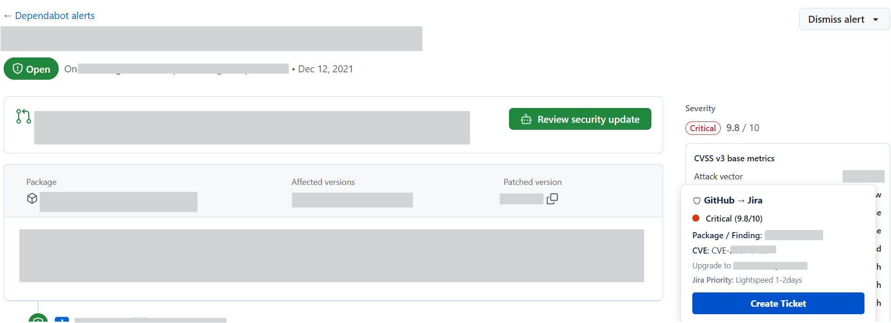
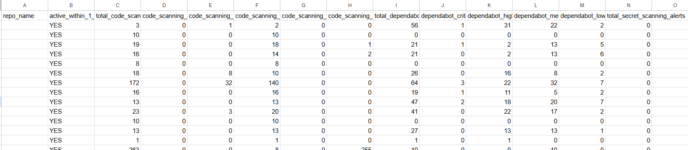

# Offensive Security Documentation

A public research journal and technical portfolio into offensive security, application security and vulnerability research.

This repository documents hands-on learning, reproducible research, and tooling built through practice. Part notebook, part portfolio of continuous progress towards a career in offensive security.

## Table of Contents
- [About](#about)
- [Featured Projects](#featured-projects)
- [Current Focus](#current-focus)
- [Connect](#connect)

## About
Cybersecurity graduate with a Bachelor's degree in Computer Science.

My path is towards **penetration testing** and **red team operations**, building up on my skills through practical experience and infosec writeups. 

**Core Interests:**
- Penetration Testing & Red Team Operations
- Web Application Security
- Vulnerability Research & CVE Triage 
- Security Automation & Tooling

## Featured Projects
Tools built to solve real security workflow problems.

### Automated Security Alert Triaging Tool
A Tampermonkey userscript that pulls GitHub Security Alerts (Dependabot, Code Scanning, Secret Scanning) through the GitHub API and turns them directly into structured Jira tickets. 

The GitHub-to-Jira flow includes deduplication in Jira (so the same alert doesn't get ticketed twice locally), exact priority matching, ADF-formatted ticket descriptions, retry logic for API reliability, and detection that handles GitHub's dynamic page loads. Tickets go into a custom Jira project.

### GitHub Repository Security Audit Script
A Python script that audits all unarchived repositories within a GitHub organization by fetching repository activity and GitHub Advanced Security (GHAS) alert data. 

It retrieves open Code Scanning, Dependabot, and Secret Scanning alerts, and categorizes the results into two CSV files based on whether the repository has been active within a specified timeframe (repo_audit_active.csv and repo_audit_inactive.csv). Repositories with a confirmed zero count across all three alert types are completely skipped to streamline the output.

### [Browser Extension Security Evaluation](evaluations/vendor_browser_ext_evaluation.md)
Authorised security evaluation of a commercial browser extension's anti-phishing and data-loss-prevention capabilities, conducted as part of a vendor assessment to test how well its detection policies hold up under adversarial conditions. 

Coverage spanned 8 evaluation areas: risky/VPN extension blocking, brand-impersonation and credit-card-form protections, session/token theft detection, and malicious file-upload scanning.

## Current Focus
* **Authorized API pentesting**: using HexStrike AI–driven recon workflows (katana, httpx-toolkit, subfinder, arjun, gau, waybackurls) for API surface discovery and scope-aware testing
* **Mobile application security**: setting up a Kali/Waydroid-based mobile pentesting environment for OAuth flow interception and mobile app testing
* **Vendor security assessments**: conducting authorised evaluations of commercial security products under adversarial conditions
* **Building toward red teaming**: progressing from web app security fundamentals (PortSwigger, OWASP Juice Shop) toward offensive tooling and adversary simulation

## Connect
[Github](https://github.com/shangxinx)

