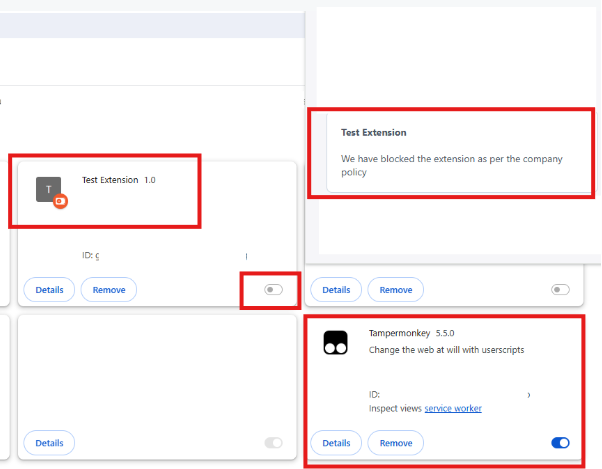
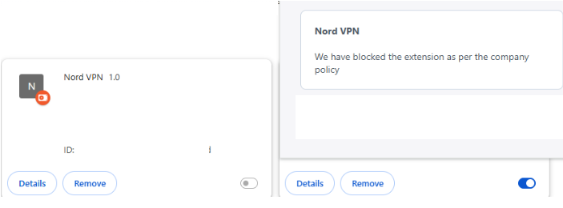
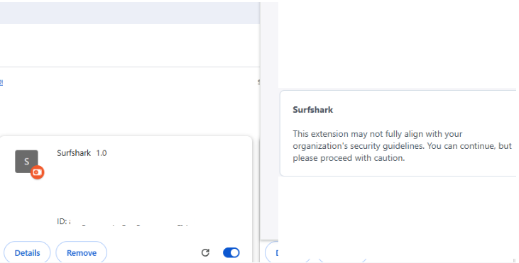
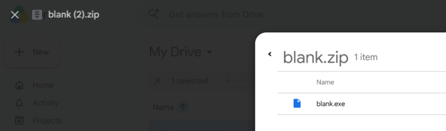
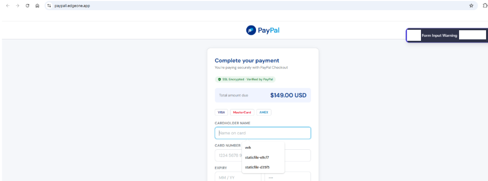
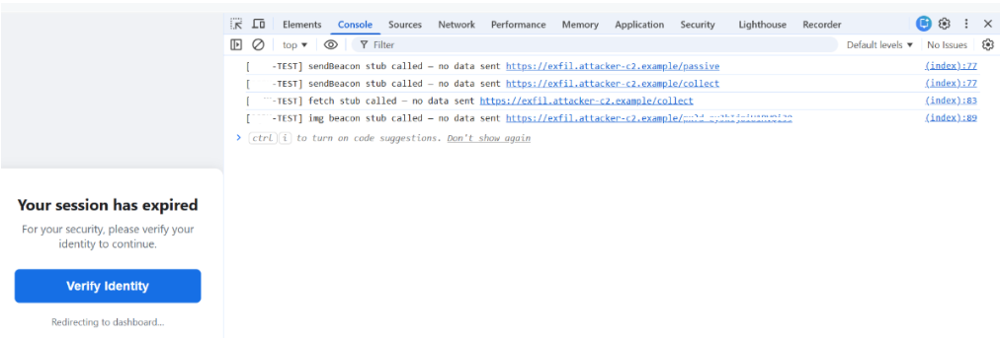

# Browser Extension Security Policy Bypasses

## Scope
Authorised testing of browser extension security policies that are meant to detect and block threats such as malicious extensions, phishing and more. Testing was self-conducted using custom extension manifests, a minimal unpacked chrome extension in developer mode, and a hosted test site on Netlify to simulate certain workflows.
If the all conditions of the policy was triggered, it would result in either or any of the following: **Block, Warn & Monitor.**

## Findings
### Block Risky Browser Extensions - Passed with notes.
The policy correctly blocks extensions meeting all conditions defined in its rules. However, detection is condition-based rather than capability-based: Tampermonkey, a tool capable of executing arbitrary JS, remains unblocked as it does not trip the configured conditions.

A sufficiently aged, reputable chrome web store listing would sit outside every threshold the policy checks. An attacker publishing a malicious extension and aging it past those thresholds would receive no block and no monitor alert.

*Security Impact: Supply chain attacks / rogue extensions. Leveraging tool to inject maliicious scripts that can lead to DOM manipulation, or sensitive data exposure.*

#
### Block VPN Browser Extensions - Partially passed.
When a manifest carrying VPN-indicative permissions (`proxy`, `webRequest`) was placed within the browser, it was found that it would be blocked only if the extension's name contained the string, 'VPN'.

Renaming the extension (with permissions unchanged) would merely drop a monitor warning without blocking it, which causes this policy to fail. One of the conditions of the policy was keying off the extension name rather than its permissions, hence a legitimately-purposed VPN extension not named with the string 'vpn' would evade this policy regardless of its actual permissions.

*Security Impact:  Insider threats can bypass network telemetry and firewalls. Facilitates unmonitored data exfiltration and access to illict command-and-control (C2) infrastructure.*

#
### Block EXE Uploads to Google Drive - Partially Passed.
While uploading an exe file directly to the drive would cause the policy to be triggered, zipping the file at least once (or twice) bypasses the policy and allows the file to be opened upon extraction. Another alternative to bypass this policy is to encrypt the zip file before uploading.

This suggests that the policy does not truly scan files for the appropriate filename extensions on different and nested levels.

*Security Impact: Lateral movement with payload delivery. Users extracting the nested payloads may cause initial compromise and malware deployment for potential ransomware execution.*

#
### Warn Brand Impersonating Credit Card Forms - Partially passed.
The phishing page was not flagged on the first visit; the warning only appeared after repeated refreshes, suggesting detection relies on accumulated visit data rather than immediate page analysis. This leaves a detection-free window on an attacker's first contact with the victim.

Not only that, swapping out keyword placeholders (such as `Card Number` and `CVV`) for any numeric or symbol equivalents (`1234 5678 9012 3456`, `•••`) would cause the `placeholder_texts` condition to silently fail. This resulted in no warning fired despite the form being visually and functionally identical to the earlier form used.

*Security Impact: Phishing campaigns. Execute successful credential harvesting and financial fraud by evading keyword-based detection through placeholder text substitution.*

#
### Read-Only Mode for Brand Impersonating Credit Forms - Failed.
No read-only mode was applied. Warning appears to be dismissible and does not stop credential entry.

*Security Impact: Phishing threat. Credential compromise or financial theft event.*

#
### Monitor Brand Impersonating Credit Card Forms - Failed.
No detection event was triggered despite visual and structural similarity to an impersonated brand's domain.

*Security Impact: Lack of telemetry. May significantly delay incident response.*

#
### Block Brand Impersonating Credit Card Forms - Failed.
`paypall.edgeone.app` was a URL containing the keyword 'paypal' that was not blocked at the URL level. Domain keyword matching against the known phishing targets did not appear to be an active detection signal.

*Security Impact: Spear-phishing campaigns, common typosquatting and subdomain abuse.*

#
### Session/Token Theft Simulation - No policy detected.
A simulated credential harvesting flow (a `Verify Identity` button that would trigger the token/session theft) was not flagged before or during the click, which meant that the social-engineering-driven theft goes undetected.

A passive beacon was fired on `DOMContentLoaded` with no user interaction was also unflagged, along with the three tested exfiltration techniques (`sendBeacon`, `fetch` with the `keepalive`flag) and an image-pixel beacon that were left unflagged in page source individually.

An attacker-indicative exfiltration domain (`attacker-c2.example`) in the source was also not flagged.

*Security Impact: Pass-The-Cookie attacks. Bypassing Multi-Factor Authentication (MFA) and achieve silent full account takeover (ATO) through passive exfiltration or active token harvesting.*

#
## Summary
Across the above mentioned eight policies, detection consistently keys off narrow, literal conditions (such as *name strings, an exact placeholder match and accumulated visit counts*) rather than the underlying capability or behaviour the policy claims to protect against.

Every bypass found here worked by satisfying the letter of the rule while violating its intent.

Consequently, an attacker aware of these rigid conditions may easily adapt their initial access, exfiltration, and credential harvesting techniques to operate entirely under the radar, rendering the intended defensive policies ineffective against the targetted threats.
